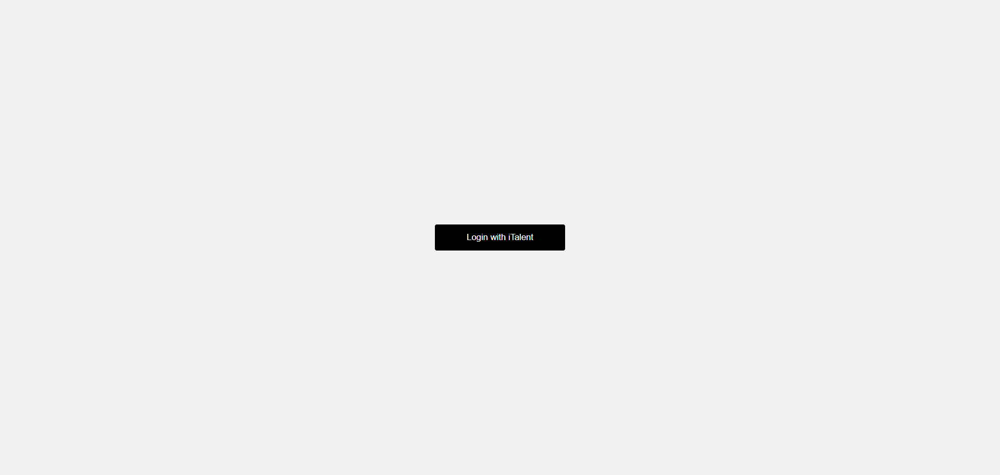

# Oautho2.0_italent2demo-

# Initial Page where we have button

# returned access Token

# access token is saved in seesion library which access token is not shown in url

# output messages , fetched messages data from https://italent2.demo.lithium.com/

